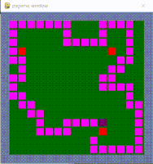
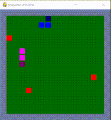

# Gym-Snake-MultiAgent

This repo is in response to OpenAI's Request for Research 2.0. https://openai.com/blog/requests-for-research-2/

In this repo you will find four experiments--a single agent snake experiment and three multi agent experiments. The multi
agent experiments include: a three agent snake game, a two agent snake game, and a 2 v 2 snake game. 
All learning in the multi agent experiments is _attempted_ through self-play.

This repo is still **a work in progress**. I'm currently figuring out how to find success in the multi agent self-play experiments.
#### Quick Start

To evaluate my pretrained models, run either `eval_pretrained_team.py`, `eval_pretrained_single.py`, 
`eval_pretrained_selfplay_3.py`, or `eval_pretrained_selfplay_2.py`. 

The script `eval_pretrained_selfplay_3.py` ends with selfplay_3. This means this script corresponds to the 3 snake self play experiment. 
The same convention is applied to other scripts.

#### Environment Information

observation_space: A tuple of size: (n_agents, resolution, resolution)

action_space: A n_agents-sized array that takes in 4 discrete actions [0, 1, 2, 3]

The observation space is populated with numbers that correspond to what is on that part of the grid.
- DEAD_OBS = -1
- FREE_OBS = 0
- FRUIT_OBS = 1
- SELF_AGENT_OBS = 2
- SELF_AGENT_HEAD_OBS = 3
- OTHER_AGENT_OBS = 4
- OTHER_AGENT_HEAD_OBS = 5

For the 2v2 Multi Agent Snake experiment the observation space is:
- DEAD_OBS = -1
- FREE_OBS = 0
- FRUIT_OBS = 1
- SELF_AGENT_OBS = 2
- SELF_AGENT_HEAD_OBS = 3
- TEAM_MEMBER_OBS = 4
- TEAM_MEMBER_HEAD_OBS = 5
- OTHER_AGENT_OBS = 6
- OTHER_AGENT_HEAD_OBS = 7

#### Experiments

There are 4 different experiments in this repo.

- Single Snake
- Multi Agent Snake Self-Play with two snakes
- Multi Agent Snake with three snakes
- 2 v 2 Multi Agent Snake

In the multi-agent experiments an episode ends when there is only one snake remaining. This is done so agents, at all times,
are exposed to other agents during an episode. This I hoped would improve multi agent performance.

As of now, the single snake experiment is the only success.

###### Single Snake

###### Multi Agent Snake Self-Play with two snakes (Work in Progress)

###### Multi Agent Snake Self-Play with three snakes (Work in Progress)

###### 2 v 2 Multi Agent Snake Self-Play (Work in Progress)

##### Rules of the Game
These games follow the conventional rules of snake. A snake can move anywhere on the grid. If it encounters a wall, itself,
or another snake, it dies. The goal of the game is to gather as many fruits as possible without encountering one’s body or the wall. 
There is an exception in 2 v 2 Multi Agent Snake. In this variant of the game teammates can pass through one another.

##### Reward Scheme
A Snake receives +1 for eating a fruit, -1 for dying, and -0.03 for every step it takes in the environment. 
The -0.03 incentives the snake to aggressively pursue the fruit. In 2v2 Snake, The reward scheme is +1 for the entire 
team if _either_ snake eats a fruit. However only the snake that actually eats a fruit will grow by one snake block.

##### On Self-Play

As mentioned, learning in the multi agent environments is done via self-play. In short, Self-play is a learning style 
where an agent learns to play a game by playing against itself. That is, when an agent is training, it uses its current 
and past selves as sparring partners. 

For self-play with two and three snakes, the algorithm roughly works as follows:

- There is a designated main agent in both games. When that main agent has a higher reward mean over the most recent 20 
episodes compared to the other snakes, the main agent's weights get copied over to the other agents.

For self-play in the 2 v 2 game, the algorithm roughly works as follows:

- The blue team has two main agents. Each blue team member has a "partner" on the other team. When the blue team has a 
higher reward mean over the most recent 20 episodes compared to the other team, the blue team agent's weights get copied
over to their partner agent.

#### References

My environment is largely based off of this repo:
https://github.com/bhairavmehta95/slitherin-gym

The DDDQN model is largely based on this implementation:
https://github.com/awjuliani/DeepRL-Agents/blob/master/Double-Dueling-DQN.ipynb

Other repos that helped with this project:
- https://github.com/grantsrb/Exploratory-MultiAgent-Snake
- https://github.com/kimbring2/OpenAI_Requests-For-Research-2_Slitherin
- https://github.com/hardmaru/slimevolleygym

